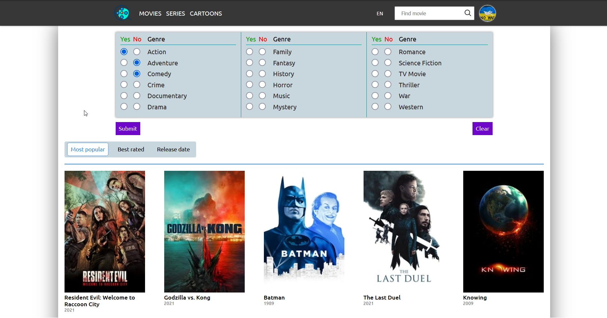

# SVD-Films

SVD-Films is a team project, which represents an application for working with movies and series.
It gives an opportunity to:
  * `Search for the movies and series to watch by different parameters (genres, popularity, release date, etc.)`
  * `Search for specific media-resource by title`
  * `Discover anything about the movie (overview, actors, trailers, etc.)`
  * `Rate watched movies and series`
  * `Adding movies and series to 'watch later' or 'favourite' lists`

In this project we have used React(and some TypeScript) for the front-end & Express(Node.js) for the back-end.
This product uses the TMDB API but is not endorsed or certified by TMDB.

Demo: [SVD-Films](https://youthful-tereshkova-42b5d8.netlify.app/)
